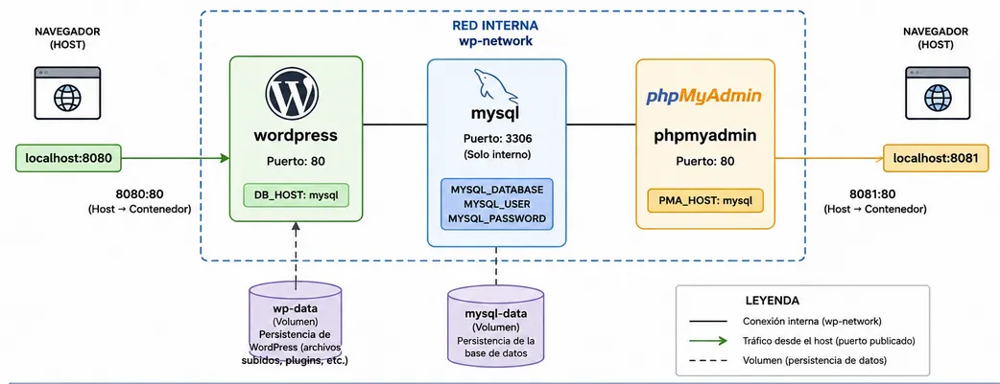
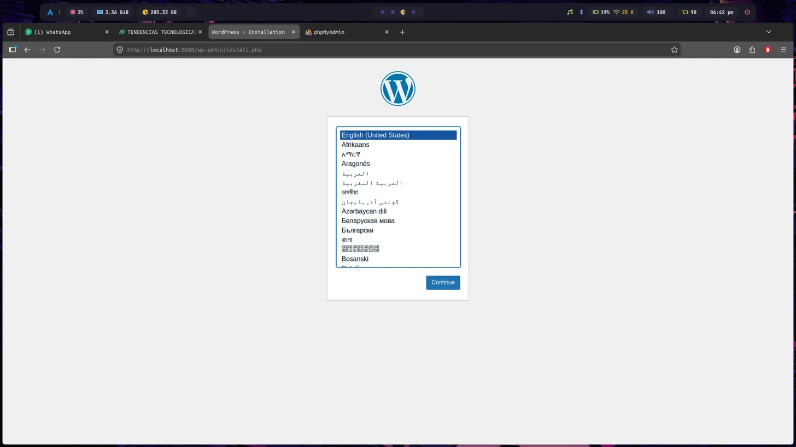
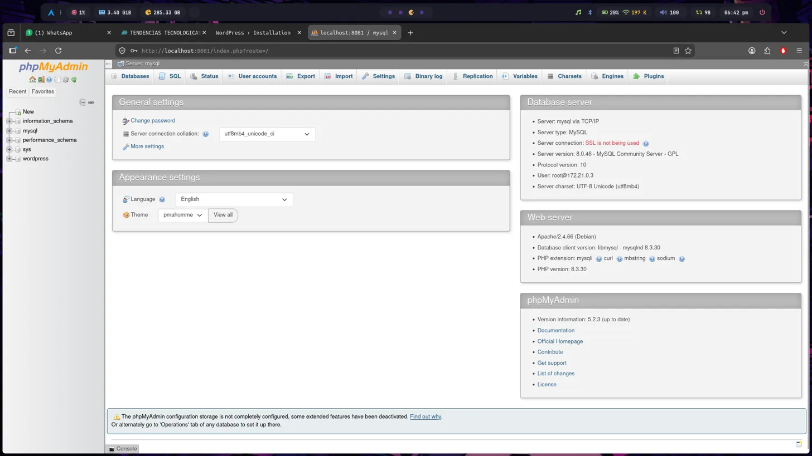

# Práctica No. 5 - Sitio WordPress con Docker

## 1. Título

Creación y despliegue de un sitio WordPress utilizando contenedores Docker con MySQL y phpMyAdmin

## 2. Tiempo de duración

30 minutos aproximadamente

## 3. Fundamentos

**Docker** es una plataforma de contenedorización que permite empaquetar aplicaciones y sus dependencias en unidades aisladas llamadas contenedores. Cada contenedor es independiente del sistema operativo anfitrión y de otros contenedores, lo que garantiza que las aplicaciones se ejecuten de manera consistente en cualquier entorno.

Uno de los conceptos clave en Docker es la **red de contenedores**. Por defecto, los contenedores están aislados entre sí, pero mediante la creación de una red personalizada (`docker network create`), es posible que múltiples contenedores se comuniquen entre ellos usando sus nombres como hostname. En esta práctica se creó una red llamada `wp-network` que permite que WordPress se conecte directamente a MySQL sin exponer la base de datos al exterior.

**MySQL** es uno de los sistemas de gestión de bases de datos relacionales más utilizados en el mundo. Es de código abierto y ampliamente compatible con aplicaciones web. En esta práctica, MySQL actúa como el backend de datos de WordPress, almacenando toda la información del sitio: usuarios, publicaciones, páginas, configuraciones y plugins.

**WordPress** es el sistema de gestión de contenido (CMS) más popular del mundo, utilizado para crear desde blogs personales hasta sitios web empresariales complejos. WordPress requiere una base de datos MySQL para funcionar y un servidor web (Apache o Nginx) para servir el contenido. La imagen oficial de Docker de WordPress incluye Apache preconfigurado, lo que simplifica enormemente el despliegue.

**phpMyAdmin** es una herramienta web de administración de bases de datos MySQL. Permite visualizar, crear, editar y eliminar bases de datos, tablas y registros a través de una interfaz gráfica en el navegador, sin necesidad de usar la línea de comandos.

Los **volúmenes Docker** son mecanismos de almacenamiento persistente que sobreviven al ciclo de vida de los contenedores. En esta práctica se usaron dos volúmenes: `wp-data` para persistir los archivos de WordPress (plugins, temas, imágenes subidas) y `mysql-data` para persistir los datos de la base de datos. Sin volúmenes, toda la información se perdería al eliminar los contenedores.

La **exposición de puertos** (`-p host:contenedor`) permite acceder a los servicios del contenedor desde el navegador del sistema anfitrión. WordPress se expone en el puerto `8080` y phpMyAdmin en el `8081`, mientras que MySQL solo es accesible internamente dentro de la red `wp-network`.

## 4. Conocimientos previos

Para realizar esta práctica el estudiante necesita tener claro los siguientes temas:

- Uso básico de la terminal de Linux
- Conceptos básicos de Docker (imágenes, contenedores, puertos, volúmenes)
- Comandos Docker (`run`, `ps`, `network`, `volume`)
- Conceptos básicos de bases de datos relacionales
- Manejo del navegador web

## 5. Objetivos a alcanzar

- Crear una red Docker personalizada para comunicación entre contenedores
- Crear volúmenes Docker para persistencia de datos
- Desplegar un contenedor MySQL como base de datos del sitio
- Desplegar phpMyAdmin para administración visual de la base de datos
- Desplegar WordPress conectado a MySQL a través de la red interna
- Verificar el funcionamiento del sitio accediendo desde el navegador

## 6. Equipo necesario

- Computador con sistema operativo Linux, Windows (WSL) o Mac
- Terminal de comandos
- Docker instalado (versión 20.x o superior)
- Navegador web (Chrome, Firefox, etc.)
- Conexión a internet (para descargar imágenes de Docker Hub)

## 7. Material de apoyo

- Documentación oficial de Docker: https://docs.docker.com
- Imagen oficial de WordPress: https://hub.docker.com/_/wordpress
- Imagen oficial de MySQL: https://hub.docker.com/_/mysql
- Imagen oficial de phpMyAdmin: https://hub.docker.com/_/phpmyadmin
- Guía de la asignatura

## 8. Procedimiento

### Paso 1: Crear la red interna de Docker

Se creó una red personalizada llamada `wp-network` que permitirá la comunicación entre los contenedores:

```bash
docker network create wp-network
```

### Paso 2: Crear los volúmenes para persistencia

Se crearon dos volúmenes: uno para los archivos de WordPress y otro para los datos de MySQL:

```bash
docker volume create wp-data
docker volume create mysql-data
```

### Paso 3: Crear el contenedor de MySQL

Se desplegó el contenedor de MySQL con las credenciales necesarias para WordPress:

```bash
docker run -d \
  --name mysql \
  --network wp-network \
  -e MYSQL_ROOT_PASSWORD=1234 \
  -e MYSQL_DATABASE=wordpress \
  -e MYSQL_USER=wpuser \
  -e MYSQL_PASSWORD=wppass \
  -v mysql-data:/var/lib/mysql \
  mysql:8.0
```

MySQL queda accesible únicamente de forma interna en el puerto `3306`, no expuesto al exterior.

### Paso 4: Crear el contenedor de phpMyAdmin

Se desplegó phpMyAdmin conectado a la red interna y apuntando al contenedor MySQL:

```bash
docker run -d \
  --name phpmyadmin \
  --network wp-network \
  -e PMA_HOST=mysql \
  -e MYSQL_ROOT_PASSWORD=1234 \
  -p 8081:80 \
  phpmyadmin
```

### Paso 5: Crear el contenedor de WordPress

Se desplegó WordPress conectado a la red interna y configurado para usar la base de datos MySQL:

```bash
docker run -d \
  --name wordpress \
  --network wp-network \
  -e WORDPRESS_DB_HOST=mysql \
  -e WORDPRESS_DB_USER=wpuser \
  -e WORDPRESS_DB_PASSWORD=wppass \
  -e WORDPRESS_DB_NAME=wordpress \
  -v wp-data:/var/www/html \
  -p 8080:80 \
  wordpress
```

### Paso 6: Verificar que todos los contenedores están en ejecución

```bash
docker ps
```

Los tres contenedores deben aparecer en estado `Up`.

### Paso 7: Diagrama de la arquitectura desplegada

El siguiente diagrama muestra la relación entre los contenedores, la red interna, los volúmenes y los puertos expuestos al sistema anfitrión:



*Figura 1-1. Diagrama de arquitectura de contenedores Docker para WordPress.*

### Paso 8: Acceder a WordPress desde el navegador

Se abrió el navegador y se accedió a `http://localhost:8080`, donde se presentó el instalador de WordPress solicitando seleccionar el idioma.



*Figura 1-2. Pantalla de instalación de WordPress accedida en http://localhost:8080.*

### Paso 9: Verificar phpMyAdmin desde el navegador

Se accedió a `http://localhost:8081` para confirmar que phpMyAdmin estaba operativo y conectado correctamente al contenedor MySQL.



*Figura 1-3. Panel de phpMyAdmin mostrando la base de datos wordpress creada en http://localhost:8081.*

## 9. Resultados esperados

Al finalizar la práctica se obtuvieron los siguientes resultados:

- Se creó correctamente la red `wp-network` que permite la comunicación interna entre los tres contenedores sin exponer MySQL al exterior
- El contenedor `mysql` quedó operativo con la base de datos `wordpress` creada y accesible únicamente desde la red interna en el puerto `3306`
- El contenedor `phpmyadmin` quedó accesible desde el navegador en `http://localhost:8081`, mostrando correctamente la base de datos `wordpress` y permitiendo su administración gráfica
- El contenedor `wordpress` quedó accesible desde el navegador en `http://localhost:8080`, mostrando el instalador de WordPress listo para configurarse
- Los volúmenes `wp-data` y `mysql-data` garantizan que los datos persistan aunque los contenedores sean eliminados y recreados
- Se comprobó que la arquitectura de múltiples contenedores comunicados por red interna funciona correctamente y es una práctica estándar en entornos de desarrollo modernos

Como resultado general, se logró desplegar un stack web completo (base de datos + administrador + CMS) usando únicamente comandos Docker, comprendiendo el rol de las redes, volúmenes y variables de entorno en la orquestación de contenedores.

## 10. Bibliografía
