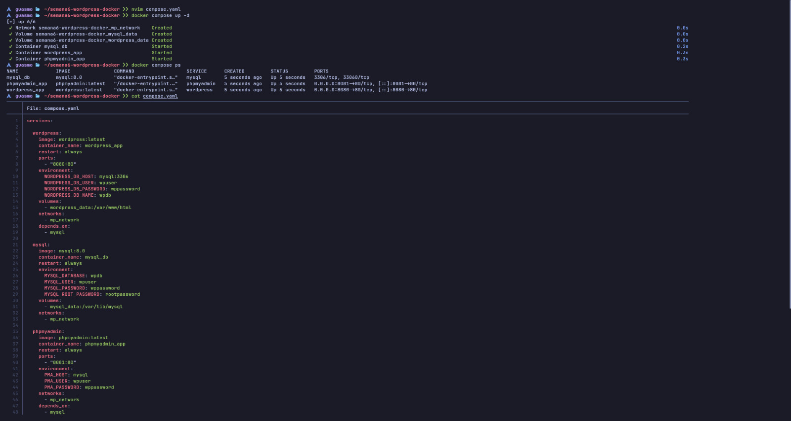
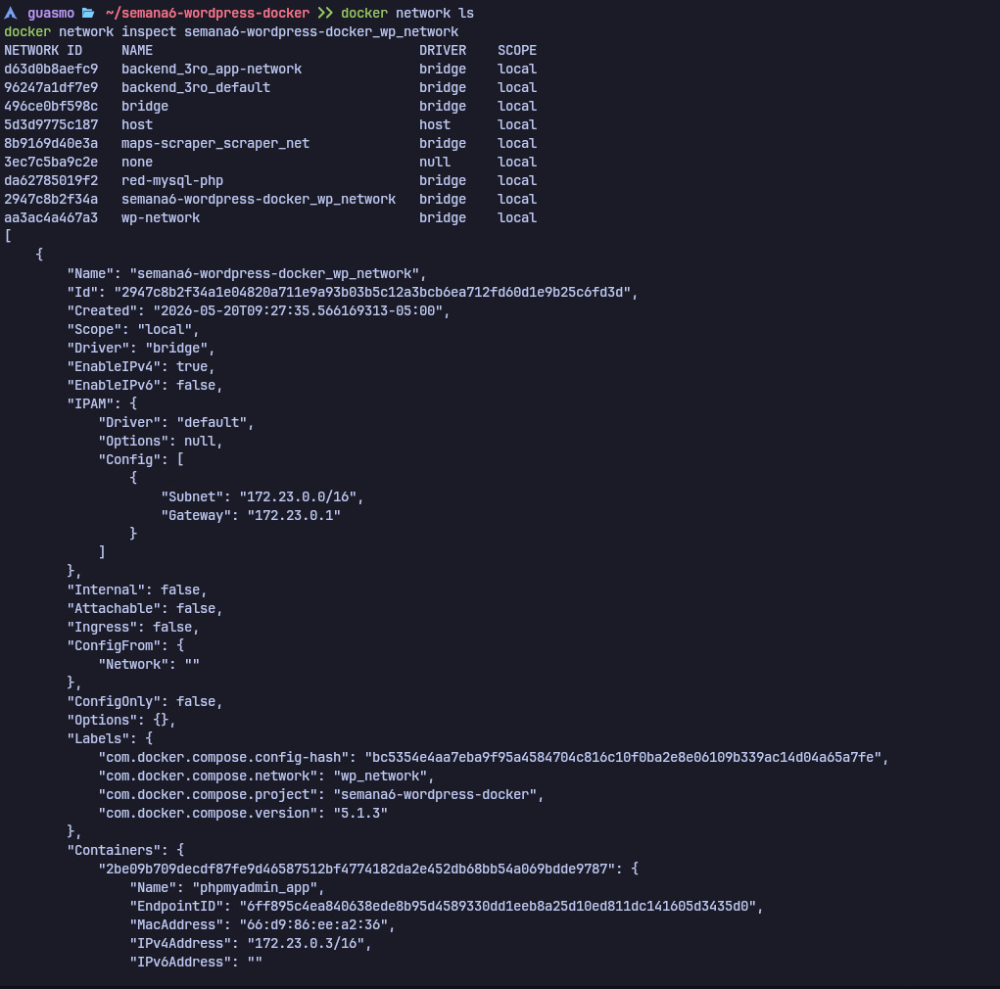
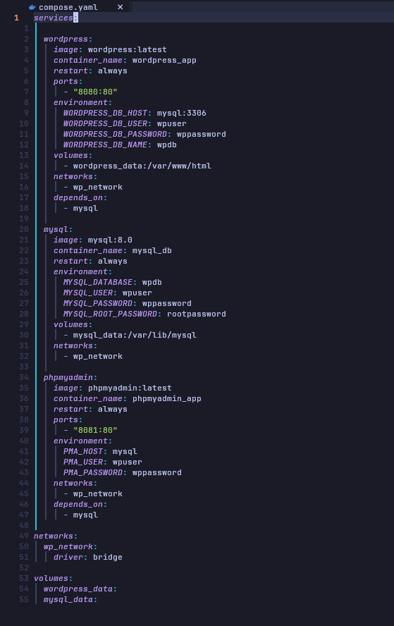
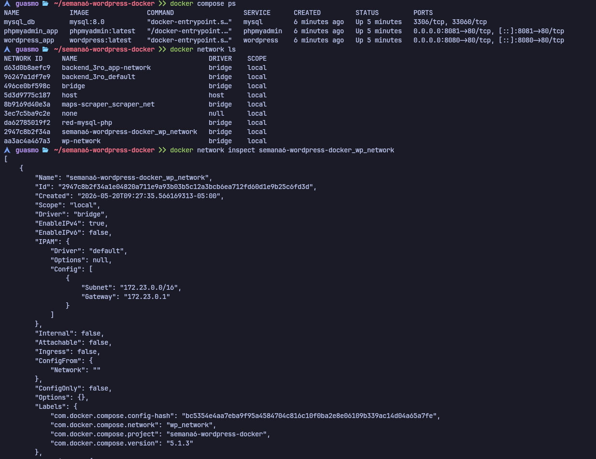
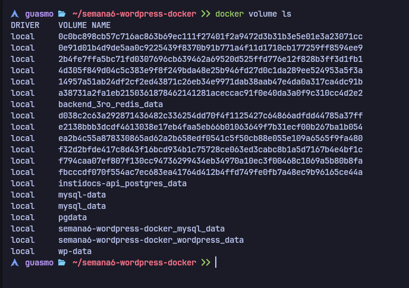

# Práctica No. 6 - WordPress con Docker Compose (MySQL + phpMyAdmin)

## 1. Título

Despliegue de un sitio WordPress usando Docker Compose con MySQL y phpMyAdmin mediante un archivo `compose.yaml`

---

## 2. Tiempo de duración

60 minutos aproximadamente

---

## 3. Fundamentos

**Docker Compose** es una herramienta oficial de Docker que permite definir y ejecutar aplicaciones multi-contenedor a través de un único archivo de configuración en formato YAML (`compose.yaml` o `docker-compose.yml`). En lugar de ejecutar varios comandos `docker run` de forma separada, Docker Compose permite declarar todos los servicios, redes y volúmenes de una arquitectura en un solo archivo y levantarlos con un único comando: `docker compose up`. Esto facilita enormemente la reproducibilidad del entorno, la colaboración en equipos y el despliegue en diferentes máquinas de forma consistente.

La especificación de Docker Compose sigue un formato estructurado en YAML con las siguientes secciones principales: `services` (define cada contenedor y su configuración), `networks` (define las redes personalizadas) y `volumes` (define los volúmenes de persistencia). Cada servicio puede declarar su imagen, nombre de contenedor, política de reinicio, puertos expuestos, variables de entorno, volúmenes montados, red a la que pertenece y dependencias con otros servicios.

Las **redes en Docker Compose** funcionan de la misma forma que las redes personalizadas en Docker clásico. Al definir una red de tipo `bridge`, todos los contenedores conectados a ella pueden comunicarse entre sí usando el nombre del servicio como hostname, gracias al DNS interno de Docker. En esta práctica, la red `wp_network` permite que WordPress se comunique con MySQL usando el hostname `mysql`, y que phpMyAdmin haga lo mismo, sin necesidad de exponer MySQL al exterior.

La directiva **`depends_on`** en Docker Compose establece el orden de arranque entre servicios. Al declarar que `wordpress` y `phpmyadmin` dependen de `mysql`, Docker Compose garantiza que el contenedor de MySQL arranque antes que los otros dos. Esto es importante para evitar errores de conexión cuando un servicio intenta conectarse a una base de datos que aún no está lista.

La directiva **`restart: always`** configura la política de reinicio del contenedor. Con este valor, Docker reiniciará automáticamente el contenedor si se detiene por cualquier razón: error de la aplicación, reinicio del sistema, o actualización del daemon de Docker. Es la configuración recomendada para servicios en producción.

Los **volúmenes en Docker Compose** se declaran en la sección `volumes` del archivo y se referencian dentro de cada servicio. Los volúmenes nombrados (`named volumes`) son gestionados completamente por Docker y persisten de forma independiente al ciclo de vida de los contenedores. Cuando un contenedor es eliminado y recreado usando el mismo volumen, los datos almacenados permanecen intactos. En esta práctica se usan dos volúmenes: `wordpress_data` para los archivos del sitio WordPress (temas, plugins, imágenes subidas) y `mysql_data` para los datos de la base de datos MySQL.

**WordPress** es el CMS (Content Management System) más utilizado en el mundo. Su imagen oficial de Docker Hub incluye Apache preconfigurado y acepta variables de entorno para la conexión con la base de datos (`WORDPRESS_DB_HOST`, `WORDPRESS_DB_USER`, `WORDPRESS_DB_PASSWORD`, `WORDPRESS_DB_NAME`), lo que permite su configuración completa en el momento de creación del contenedor sin editar archivos manualmente.

**phpMyAdmin** es una herramienta de administración web para MySQL. Su imagen oficial acepta las variables `PMA_HOST` y `PMA_USER` para conectarse al servidor de base de datos. Al ser parte de la misma red interna, phpMyAdmin puede resolver el hostname `mysql` directamente.

---

## 4. Conocimientos previos

Para realizar esta práctica el estudiante necesita tener claro los siguientes temas:

- Uso básico de la terminal de Linux
- Conceptos fundamentales de Docker (imágenes, contenedores, puertos, volúmenes, redes)
- Sintaxis básica del formato YAML
- Comandos Docker Compose (`up`, `down`, `ps`, `logs`)
- Conceptos básicos de bases de datos relacionales (MySQL)
- Manejo del navegador web para verificar resultados

---

## 5. Objetivos a alcanzar

- Definir una arquitectura multi-contenedor completa usando un archivo `compose.yaml`
- Estructurar tres servicios: `wordpress`, `mysql` y `phpmyadmin`
- Configurar una red personalizada de tipo `bridge` para comunicación interna entre servicios
- Definir volúmenes Docker para garantizar la persistencia de datos
- Verificar el despliegue de los tres contenedores con `docker compose ps`
- Inspeccionar la red y los volúmenes creados automáticamente por Docker Compose
- Acceder a WordPress y phpMyAdmin desde el navegador

---

## 6. Equipo necesario

- Computador con sistema operativo Linux, Windows (WSL) o Mac
- Terminal de comandos
- Docker instalado (versión 24.x o superior)
- Docker Compose Plugin instalado (incluido en Docker Desktop y Docker Engine moderno)
- Editor de texto en terminal (nvim o nano)
- Navegador web (Chrome, Firefox, etc.)
- Conexión a internet (para descargar imágenes de Docker Hub)

---

## 7. Material de apoyo

- Documentación oficial de Docker Compose: https://docs.docker.com/compose/
- Referencia de la especificación Compose: https://docs.docker.com/reference/compose-file/
- Imagen oficial de WordPress en Docker Hub: https://hub.docker.com/_/wordpress
- Imagen oficial de MySQL en Docker Hub: https://hub.docker.com/_/mysql
- Imagen oficial de phpMyAdmin en Docker Hub: https://hub.docker.com/_/phpmyadmin
- Documentación de redes en Docker: https://docs.docker.com/engine/network/
- Documentación de volúmenes en Docker: https://docs.docker.com/engine/storage/volumes/
- Guía de la asignatura semana 6

---

## 8. Procedimiento

### Paso 1: Crear el directorio del proyecto

Se creó el directorio de trabajo para la práctica y se accedió a él:

```bash
mkdir semana6-wordpress-docker
cd semana6-wordpress-docker
```

---

### Paso 2: Crear el archivo `compose.yaml`

Se creó el archivo de configuración de Docker Compose con el editor `nvim`:

```bash
nvim compose.yaml
```

El contenido completo del archivo `compose.yaml` es el siguiente:

```yaml
services:

  wordpress:
    image: wordpress:latest
    container_name: wordpress_app
    restart: always
    ports:
      - "8080:80"
    environment:
      WORDPRESS_DB_HOST: mysql:3306
      WORDPRESS_DB_USER: wpuser
      WORDPRESS_DB_PASSWORD: wppassword
      WORDPRESS_DB_NAME: wpdb
    volumes:
      - wordpress_data:/var/www/html
    networks:
      - wp_network
    depends_on:
      - mysql

  mysql:
    image: mysql:8.0
    container_name: mysql_db
    restart: always
    environment:
      MYSQL_DATABASE: wpdb
      MYSQL_USER: wpuser
      MYSQL_PASSWORD: wppassword
      MYSQL_ROOT_PASSWORD: rootpassword
    volumes:
      - mysql_data:/var/lib/mysql
    networks:
      - wp_network

  phpmyadmin:
    image: phpmyadmin:latest
    container_name: phpmyadmin_app
    restart: always
    ports:
      - "8081:80"
    environment:
      PMA_HOST: mysql
      PMA_USER: wpuser
      PMA_PASSWORD: wppassword
    networks:
      - wp_network
    depends_on:
      - mysql

networks:
  wp_network:
    driver: bridge

volumes:
  wordpress_data:
  mysql_data:
```

**Explicación del archivo:**

| Elemento | Descripción |
|---|---|
| `services` | Define los tres contenedores del stack |
| `image` | Imagen oficial de Docker Hub a utilizar |
| `container_name` | Nombre personalizado del contenedor |
| `restart: always` | El contenedor se reinicia automáticamente si falla |
| `ports` | Mapeo `host:contenedor` para acceso externo |
| `environment` | Variables de entorno de configuración |
| `volumes` | Montaje de volumen persistente |
| `networks` | Red interna a la que se conecta el servicio |
| `depends_on` | Define el orden de arranque de los servicios |
| `networks.wp_network` | Declaración de la red personalizada tipo bridge |
| `volumes.wordpress_data / mysql_data` | Declaración de los volúmenes nombrados |

---

### Paso 3: Levantar los servicios con Docker Compose

Con el archivo `compose.yaml` guardado, se levantaron todos los servicios en segundo plano con el siguiente comando:

```bash
docker compose up -d
```

Docker Compose procesó el archivo y realizó las siguientes acciones automáticamente:
- Creó la red `semana6-wordpress-docker_wp_network`
- Creó los volúmenes `semana6-wordpress-docker_mysql_data` y `semana6-wordpress-docker_wordpress_data`
- Descargó las imágenes necesarias desde Docker Hub
- Arrancó los tres contenedores: `mysql_db`, `wordpress_app` y `phpmyadmin_app`



*Figura 6-1. Ejecución de `docker compose up -d` mostrando la creación de red, volúmenes y contenedores, junto al contenido completo del archivo `compose.yaml`.*

---

### Paso 4: Verificar el estado de los contenedores

Se verificó que los tres contenedores estuvieran activos y correctamente mapeados en sus puertos:

```bash
docker compose ps
```

Los tres servicios deben aparecer en estado `Up`:

| NAME | IMAGE | SERVICE | PORTS |
|---|---|---|---|
| mysql_db | mysql:8.0 | mysql | 3306/tcp, 33060/tcp |
| phpmyadmin_app | phpmyadmin:latest | phpmyadmin | 0.0.0.0:8081→80/tcp |
| wordpress_app | wordpress:latest | wordpress | 0.0.0.0:8080→80/tcp |

---

### Paso 5: Verificar las redes creadas por Docker Compose

Se listaron todas las redes activas en Docker para confirmar la creación de `wp_network`:

```bash
docker network ls
```

Se inspeccionó la red para ver los contenedores conectados y su configuración de subred:

```bash
docker network inspect semana6-wordpress-docker_wp_network
```

La inspección reveló:

- **Nombre:** `semana6-wordpress-docker_wp_network`
- **Driver:** `bridge`
- **Subred:** `172.23.0.0/16`
- **Gateway:** `172.23.0.1`
- Los tres contenedores registrados con sus respectivas IPs asignadas automáticamente



*Figura 6-2. Listado de redes Docker y detalle de inspección de la red `wp_network` con sus contenedores conectados y configuración IPAM.*



*Figura 6-3. Archivo `compose.yaml` visualizado en el editor nvim mostrando la declaración de los tres servicios, la red `wp_network` y los volúmenes `wordpress_data` y `mysql_data`.*



*Figura 6-4. Estado de los contenedores con `docker compose ps` y detalle de la inspección de red, confirmando los tres servicios en estado `Up` con sus puertos mapeados correctamente.*

---

### Paso 6: Verificar los volúmenes creados

Se listaron todos los volúmenes Docker para confirmar la creación de los volúmenes del stack:

```bash
docker volume ls
```

Los volúmenes creados por Docker Compose aparecen con el prefijo del nombre del proyecto:

- `semana6-wordpress-docker_mysql_data`
- `semana6-wordpress-docker_wordpress_data`

Estos volúmenes persisten en el sistema aunque los contenedores sean eliminados.



*Figura 6-5. Listado de volúmenes Docker donde se observan los volúmenes `semana6-wordpress-docker_mysql_data` y `semana6-wordpress-docker_wordpress_data` creados automáticamente por Docker Compose.*

---

### Paso 7: Acceder a WordPress desde el navegador

Se abrió el navegador y se accedió a la URL:

```
http://localhost:8080
```

WordPress presentó su instalador inicial donde se seleccionó el idioma y se completó la configuración básica del sitio.

> **📌 Imagen a insertar:** Captura de pantalla del instalador de WordPress en `http://localhost:8080`

*Figura 6-6. Pantalla del instalador de WordPress accedida en `http://localhost:8080` confirmando que el contenedor `wordpress_app` está operativo y conectado a MySQL.*

---

### Paso 8: Acceder a phpMyAdmin desde el navegador

Se accedió a phpMyAdmin en:

```
http://localhost:8081
```

phpMyAdmin mostró su panel de administración conectado al contenedor `mysql_db`, donde se puede verificar la base de datos `wpdb` creada automáticamente por las variables de entorno.

> **📌 Imagen a insertar:** Captura de pantalla del panel de phpMyAdmin en `http://localhost:8081`

*Figura 6-7. Panel de phpMyAdmin en `http://localhost:8081` mostrando la conexión exitosa al contenedor MySQL y la base de datos `wpdb` creada por las variables de entorno.*

---

### Paso 9: Detener y limpiar el entorno (opcional)

Para detener todos los servicios sin eliminar los volúmenes:

```bash
docker compose down
```

Para eliminar también los volúmenes (se perderán los datos):

```bash
docker compose down -v
```

---

## 9. Resultados esperados

Al finalizar la práctica se obtuvieron los siguientes resultados:

- Se creó correctamente el archivo `compose.yaml` definiendo los tres servicios (`wordpress`, `mysql`, `phpmyadmin`), una red personalizada (`wp_network`) y dos volúmenes nombrados (`wordpress_data`, `mysql_data`) en un único archivo de configuración declarativa

- Con el comando `docker compose up -d`, Docker Compose creó automáticamente todos los recursos: la red `semana6-wordpress-docker_wp_network`, los volúmenes `semana6-wordpress-docker_mysql_data` y `semana6-wordpress-docker_wordpress_data`, y los tres contenedores (`mysql_db`, `wordpress_app`, `phpmyadmin_app`) en estado `Up`

- La red `wp_network` de tipo `bridge` con subred `172.23.0.0/16` conectó los tres contenedores internamente, permitiendo que WordPress acceda a MySQL en el puerto `3306` usando el hostname `mysql` sin exposición externa

- El contenedor `phpmyadmin_app` quedó accesible en `http://localhost:8081`, mostrando la interfaz de administración conectada al contenedor MySQL y la base de datos `wpdb`

- El contenedor `wordpress_app` quedó accesible en `http://localhost:8080`, presentando el instalador de WordPress listo para configuración

- La directiva `depends_on` garantizó que MySQL arrancara antes que WordPress y phpMyAdmin, evitando errores de conexión durante el inicio

- Los volúmenes garantizan que tanto los archivos de WordPress como los datos de MySQL persistan entre reinicios de contenedores

- Se comprobó que toda la arquitectura multi-contenedor (red + volúmenes + servicios + dependencias) puede definirse y levantarse con un único archivo `compose.yaml`, lo que demuestra la ventaja de Docker Compose sobre la ejecución manual de múltiples comandos `docker run`

Como resultado general, se logró desplegar un stack web completo y reproducible usando Docker Compose, comprendiendo la diferencia entre gestión manual de contenedores y orquestación declarativa con archivos Compose.

---

## 10. Bibliografía

- Docker Inc. (2025). *Docker Compose overview*. Docker Documentation. https://docs.docker.com/compose/
- Docker Inc. (2025). *Compose file reference*. Docker Documentation. https://docs.docker.com/reference/compose-file/
- Docker Inc. (2025). *Networking in Compose*. Docker Documentation. https://docs.docker.com/compose/how-tos/networking/
- Docker Inc. (2025). *Use volumes*. Docker Documentation. https://docs.docker.com/engine/storage/volumes/
- Docker Inc. (2025). *Volumes top-level element*. Docker Documentation. https://docs.docker.com/reference/compose-file/volumes/
- Docker Inc. (2025). *WordPress - Official Image*. Docker Hub. https://hub.docker.com/_/wordpress
- Docker Inc. (2025). *MySQL - Official Image*. Docker Hub. https://hub.docker.com/_/mysql
- Docker Inc. (2025). *phpMyAdmin - Official Image*. Docker Hub. https://hub.docker.com/_/phpmyadmin
- Docker Inc. (2025). *depends_on - Compose Deploy Specification*. Docker Documentation. https://docs.docker.com/reference/compose-file/services/#depends_on
- MySQL AB. (2025). *MySQL 8.0 Reference Manual*. Oracle Corporation. https://dev.mysql.com/doc/refman/8.0/en/
